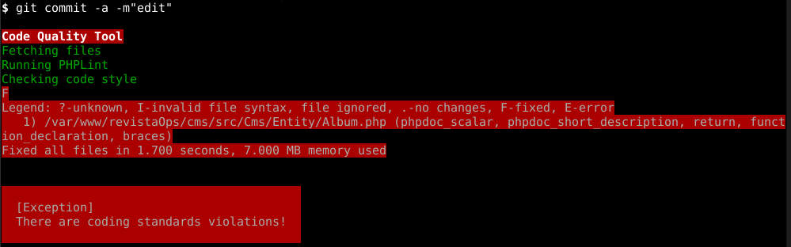
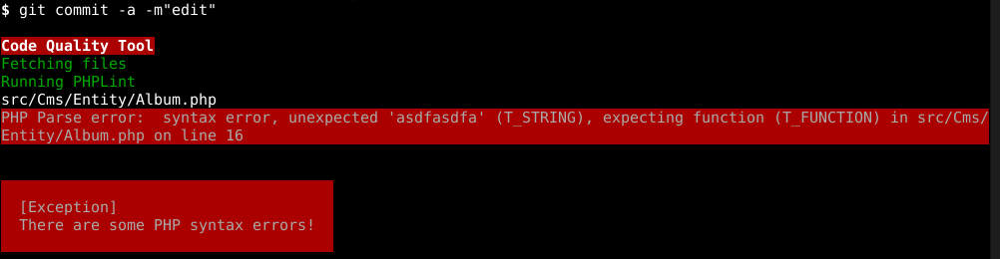
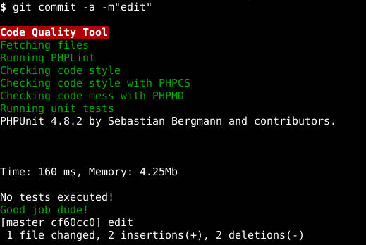

# Git Hooks hook

Checks in our gitHooks hook

* Syntax check with php lint (“php -l”): We check every committed file has a valid PHP syntax.
* Sync check of composer.json and composer.lock files: We check these two files are committed together in order to avoid committing the json but not the lock and generate some issue to another developers.
* PHP CS Fixer check: With the –dry-run parameter it does not fix, just say what the problems are. With the –fixers parameter you can control what fixers you want to execute.
* PHP Code Sniffer check: Same as before, but another rule that checks another rules.
* PHPMD: We have enabled the controversial rules.
* Unit Testing check: We run around 3.000 tests right now.







**INSTALLATION:**

The recommended way to install this library is through [Composer](http://getcomposer.org):

add `juizmill/pre-commit` as a composer dependency.

composer.json
```bash
"require-dev": {
    ...
    "juizmill/gitHooks": "dev-master"
}
```

`php composer.phar update juizmill/gitHooks`


**USAGE:**

When a developer clones the project, it just needs to:

Edit composer.json and add:

```
    "scripts": {
        "pre-update-cmd": "GitHooks\\Composer\\Script\\Hooks::preHooks",
        "pre-install-cmd": "GitHooks\\Composer\\Script\\Hooks::preHooks",
        "post-update-cmd": "GitHooks\\Composer\\Script\\Hooks::postHooks",
        "post-install-cmd": "GitHooks\\Composer\\Script\\Hooks::postHooks"
    }
```

Remembering to set up the hooks


Custom config
--------------

Copy arquives `vendor/juizmill/gitHooks/config/*` to [project]


Reference
-----------

 [Write your git hooks in PHP and keep them under git control](http://carlosbuenosvinos.com/write-your-git-hooks-in-php-and-keep-them-under-git-control/)
 
 [PHP_CodeSniffer](https://github.com/squizlabs/PHP_CodeSniffer/wiki/Annotated-ruleset.xml)
 
 [PHP-CS-FIX](http://cs.sensiolabs.org/)
 
 [PHPMD](http://phpmd.org/documentation/index.html)

 [Custom PHPCS and PHPMD](http://edorian.github.io/php-coding-standard-generator/#phpmd)
